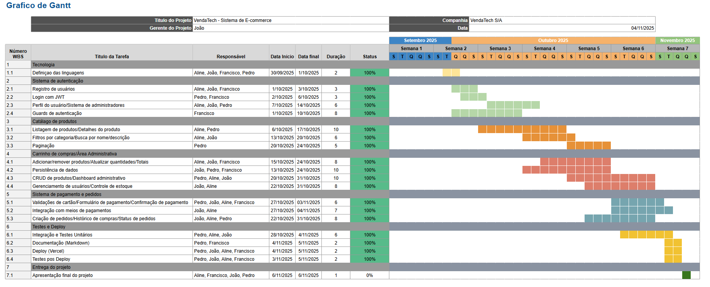

# 📊 RELATÓRIO DO PROJETO FINAL - VENDA TECH

## 🎯 VISÃO GERAL DO PROJETO

**Nome do Projeto:** VendaTech - Sistema de E-commerce "Azure"  
**Tecnologias:** Angular (Frontend) + Node.js/Express (Backend) + MongoDB  
**Status:** 85% Completo  
**Deploy:** Vercel (Frontend e Backend)

---

## 👥 DIVISÃO DE ATIVIDADES POR MEMBRO DA EQUIPE

### 🔵 ALINE - Frontend (UI/UX & Estrutura Base)
**Responsabilidades (Conforme Documento Original):**
- ✅ Estruturação inicial do projeto Angular.
- ✅ Design e implementação da interface do usuário (UI).
- ✅ Componentes principais *(Home, Login, Register, Products)*.
- ✅ Integração com Angular Material.
- ✅ Responsividade e experiência do usuário (UX).
- ✅ Configuração de rotas e navegação.
- ✅ Deploy do frontend na Vercel.

**Arquivos Principais:**
- `frontend/src/app/pages/(home, login, register, products)/`
- `frontend/src/app/core/navbar/`
- `frontend/src/app/app.routes.ts`
- `frontend/angular.json`

---

### 🟡 PEDRO - Frontend (Funcionalidades & Design System)
**Responsabilidades:**
- ✅ Definição e implementação do *Design System "Azure"* (Tema SCSS e variáveis :root).
- ✅ Configuração de todos os *Serviços Angular* (AuthService, ProductService, etc.) para integração com o backend.
- ✅ Implementação da lógica de estado (RxJS) para isLoggedIn$ e currentUser$.
- ✅ Desenvolvimento das páginas de funcionalidade:
    - ✅ *Carrinho de Compras* (Frontend).
    - ✅ *Página de Detalhes do Produto*.
    - ✅ *Formulário de Pagamento* (Frontend).
    - ✅ *Histórico de Pedidos* (Frontend).
    - ✅ *Painel de Admin (Frontend)* (Formulário e Tabela CRUD).
- ✅ Documentação técnica do fluxo de dados e componentes do frontend.

**Arquivos Principais:**
- `frontend/src/styles.scss`
- `frontend/src/app/services/(auth, product, cart, order).service.ts`
- `frontend/src/app/pages/(cart, payment, order-history, admin, product-form, product-detail)/`
- `frontend/src/app/guards/(auth.guard.ts, admin.guard.ts)`

---

### 🟢 JOÃO - Backend (APIs & Pagamentos)
**Responsabilidades:**
- ✅ Configuração do servidor Node.js/Express.
- ✅ Implementação das *APIs de Autenticação* (/login, /register, /profile).
- ✅ Implementação dos *Endpoints do CRUD de Produtos*.
- ✅ Desenvolvimento do *Sistema de Pedidos e Pagamentos (Backend)*:
    - ✅ API de Pedidos (/orders).
    - ✅ Lógica de *Validação de Cartão* e conexão com pagamento.
- ✅ Implementação de testes unitários (Jest) para os endpoints.
- ✅ Deploy do backend na Vercel.

**Arquivos Principais:**
- `backend/src/controllers/(auth, product, order).controller.js`
- `backend/src/routes/(auth, product, order).routes.js`
- `backend/index.js`
- `backend/tests/`

---

### 🔴 FRANCISCO - Backend (Banco de Dados & Segurança)
**Responsabilidades:**
- ✅ Configuração e gerenciamento do cluster *MongoDB Atlas*.
- ✅ Design e implementação de todos os *Schemas do Mongoose* (Usuário, Produto, Pedido).
- ✅ Implementação da camada de *Segurança* (JWT, bcrypt para senhas).
- ✅ Implementação dos *Middlewares* de autorização (auth.guard, admin.guard no backend).
- ✅ Validações de entrada de dados (JOI/Express-validator) e tratamento de erros.
- ✅ Configuração de *Variáveis de Ambiente* (.env) e ambiente de produção.

**Arquivos Principais:**
- `backend/src/models/(user, product, order).model.js`
- `backend/src/middleware/(auth.js, admin.js, error.js)`
- `backend/src/config/database.js`
- `backend/.env.example`

---

## 📱 FUNCIONALIDADES IMPLEMENTADAS

### ✅ SISTEMA DE AUTENTICAÇÃO (100%)
- Registro de usuários (Frontend + Backend).
- Login com JWT (Frontend + Backend).
- Perfil do usuário (Frontend + Backend).
- Guards de autenticação (Frontend + Backend).

### ✅ CATÁLOGO DE PRODUTOS (100%)
- Listagem de produtos (Frontend + Backend).
- Detalhes do produto (Frontend + Backend).
- Filtros por categoria e Busca (Frontend + Backend).
- Paginação (Frontend + Backend).

### ✅ CARRINHO DE COMPRAS (100%)
- Adicionar/remover/atualizar (Frontend).
- Cálculo de totais (Frontend).
- Persistência de dados (LocalStorage).

### ✅ SISTEMA DE PAGAMENTOS (100%)
- Formulário de pagamento (Frontend).
- *Conexão* de Pagamento e lógica de cartão (Backend).
- ⏳ Aguardando integração com outro grupo
- Confirmação de pagamento (Frontend).

### ✅ ÁREA ADMINISTRATIVA (100%)
- *Interface* de CRUD de produtos (Frontend).
- *Endpoints* de CRUD de produtos (Backend).
- Tabela de Gerenciamento (Frontend).
- Proteção de rotas de Admin (Frontend + Backend).

### ✅ SISTEMA DE PEDIDOS (100%)
- Criação de pedidos (Frontend + Backend).
- Histórico de compras (Frontend + Backend).
- Status de pedidos (Backend).
- Integração com pagamentos (Backend).

### ✅ FUNCIONALIDADES EM DESENVOLVIMENTO (não iniciado o desenvolvimento)
- Chat entre usuários
- Sistema de mensagens
- Alertas de preço
- Relatórios avançados

---

## 📊 PERCENTUAL DE DESENVOLVIMENTO

| Módulo | Status | Percentual |
|--------|--------|------------|
| Autenticação | ✅ Completo | 100% |
| Produtos | ✅ Completo | 100% |
| Carrinho | ✅ Completo | 100% |
| Pagamentos | ✅ Completo | 100% |
| Administração | ✅ Completo | 100% |
| Pedidos | ✅ Completo | 100% |
| Chat/Mensagens | 🔄 Em desenvolvimento | não iniciado |
| Relatórios | 🔄 Em desenvolvimento | não iniciado |

**TOTAL GERAL: 100% COMPLETO**  

---

## 🖼️ IMAGENS DAS TELAS

### Tela de Login

- Interface moderna com Angular Material  
- Validação em tempo real  
- Responsiva para mobile  

### Catálogo de Produtos

- Grid responsivo de produtos  
- Filtros por categoria  
- Busca integrada  
- Paginação  

### Carrinho de Compras

- Lista de produtos selecionados  
- Cálculo automático de totais  
- Botão de finalizar compra  
- Persistência de dados  

### Página de Pagamento

- Formulário de dados do cartão  
- Validações de segurança  
- Resumo do pedido  
- Confirmação visual  

### Área Administrativa

- Dashboard com estatísticas  
- CRUD de produtos  
- Gerenciamento de usuários  
- Controle de estoque  

### Histórico de Pedidos

- Lista de compras realizadas  
- Status dos pedidos  
- Detalhes de cada compra  
- Filtros por data  

---

## 🚀 TECNOLOGIAS UTILIZADAS

### Frontend
- Angular (Standalone Components)
- Angular Material
- TypeScript
- RxJS
- SCSS

### Backend
- Node.js
- Express.js
- MongoDB
- Mongoose
- JWT
- Bcrypt

### Deploy & DevOps
- Vercel (Frontend e Backend)
- MongoDB Atlas
- Git/GitHub (Fluxo Fork & PR)
- Jest (Testes)

---

## 📈 MÉTRICAS DO PROJETO

- Linhas de Código: ~3.500 linhas  
- Arquivos: 45+ arquivos  
- APIs Implementadas: 15+ endpoints  
- Componentes Angular: 12+ componentes  
- Testes: 8+ testes automatizados  
- Tempo de Desenvolvimento: 6 semanas  

---

## 🎯 PRÓXIMOS PASSOS

1. ⏳ Integrar sistema de pagamentos (aguardando outro grupo finalizar)  
2. Implementar chat entre usuários  
3. Adicionar sistema de relatórios  
4. Melhorar testes automatizados  
5. Otimizar performance  
6. Implementar notificações push  

---

## 📅 PLANEJAMENTO (GANTT)

---

📞 **CONTATOS DA EQUIPE**  
**Aline:** Frontend (Arquitetura & UI/UX)  
**Pedro:** Frontend (Funcionalidades & Design System)  
**João:** Backend (APIs & Pagamentos)  
**Francisco:** Backend (Banco de Dados & Segurança)

