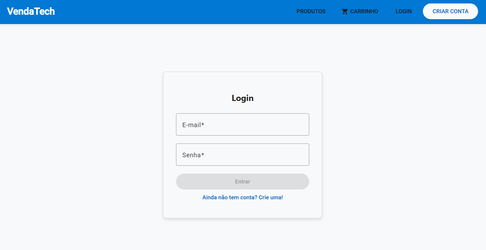
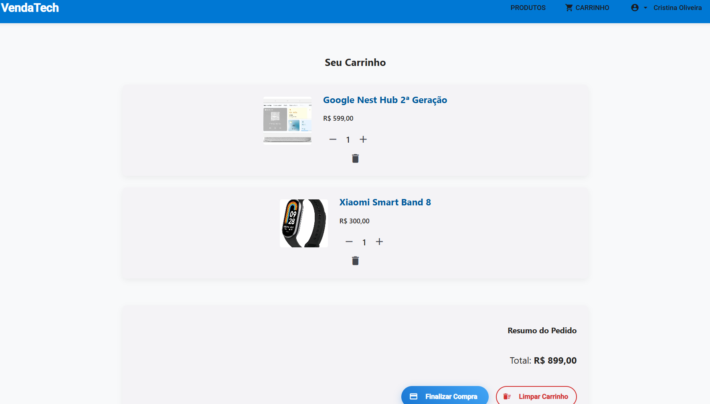
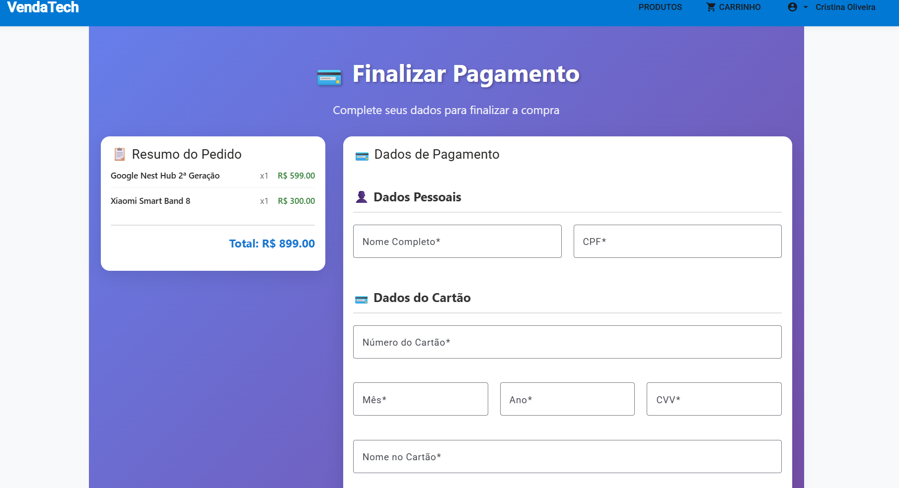
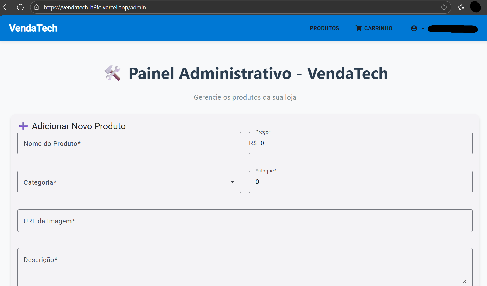
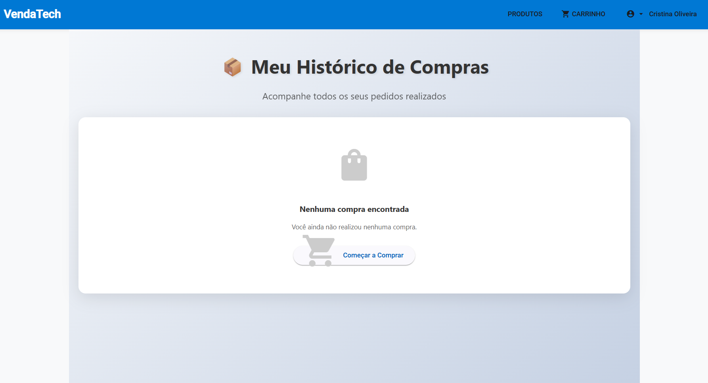

# 📊 RELATÓRIO DO PROJETO FINAL - VENDA TECH

## 🎯 **VISÃO GERAL DO PROJETO**

**Nome do Projeto:** VendaTech - Sistema de E-commerce  
**Tecnologias:** Angular 20 (Frontend) + Node.js/Express (Backend) + MongoDB  
**Status:** 85% Completo  
**Deploy:** Vercel (Frontend e Backend)

---

## 👥 **DIVISÃO DE ATIVIDADES POR MEMBRO DA EQUIPE**

### 🔵 **ALINE** - Frontend & UI/UX
**Responsabilidades:**
- ✅ Estruturação inicial do projeto Angular
- ✅ Design e implementação da interface do usuário
- ✅ Componentes principais (Home, Login, Register, Products)
- ✅ Integração com Angular Material
- ✅ Responsividade e experiência do usuário
- ✅ Configuração de rotas e navegação
- ✅ Deploy do frontend na Vercel

**Arquivos Desenvolvidos:**
- `frontend/src/app/pages/` (todas as páginas)
- `frontend/src/app/core/navbar/`
- `frontend/src/app/guards/`
- `frontend/src/app/pipes/`
- `frontend/angular.json`, `package.json`

### 🟢 **JOÃO** - Backend & APIs
**Responsabilidades:**
- ✅ Configuração do servidor Node.js/Express
- ✅ Implementação das APIs de autenticação
- ✅ CRUD completo de produtos
- ✅ Sistema de pedidos e pagamentos
- ✅ Middleware de autenticação e autorização
- ✅ Integração com MongoDB
- ✅ Deploy do backend na Vercel

**Arquivos Desenvolvidos:**
- `backend/src/controllers/` (todos os controllers)
- `backend/src/models/` (schemas do MongoDB)
- `backend/src/routes/` (todas as rotas)
- `backend/src/middleware/`
- `backend/index.js`, `package.json`

### 🟡 **PEDRO** - Integração & Testes
**Responsabilidades:**
- ✅ Integração entre frontend e backend
- ✅ Configuração de serviços Angular
- ✅ Sistema de carrinho de compras
- ✅ Implementação de testes unitários
- ✅ Configuração de ambiente de produção
- ✅ Documentação técnica

**Arquivos Desenvolvidos:**
- `frontend/src/app/services/` (todos os services)
- `backend/tests/` (testes automatizados)
- `DEPLOY_VERCEL_ATUALIZADO.md`
- `PAYMENT_INTEGRATION.md`
- Scripts de build e deploy

### 🔴 **FRANCISCO** - Banco de Dados & Segurança
**Responsabilidades:**
- ✅ Configuração do MongoDB Atlas
- ✅ Design dos schemas de dados
- ✅ Implementação de segurança (JWT, bcrypt)
- ✅ Sistema de administração
- ✅ Validações e tratamento de erros
- ✅ Configuração de variáveis de ambiente

**Arquivos Desenvolvidos:**
- `backend/src/config/database.js`
- `backend/src/models/` (schemas)
- `backend/src/middleware/auth.js`, `admin.js`
- `backend/env.*` (configurações)
- `backend/docs/MONGODB_ATLAS_SETUP.md`

---

## 📱 **FUNCIONALIDADES IMPLEMENTADAS**

### ✅ **SISTEMA DE AUTENTICAÇÃO (100%)**
- Registro de usuários
- Login com JWT
- Perfil do usuário
- Sistema de administradores
- Guards de autenticação

### ✅ **CATÁLOGO DE PRODUTOS (100%)**
- Listagem de produtos
- Detalhes do produto
- Filtros por categoria
- Busca por nome/descrição
- Paginação

### ✅ **CARRINHO DE COMPRAS (100%)**
- Adicionar/remover produtos
- Atualizar quantidades
- Cálculo de totais
- Persistência de dados

### 🔄 **SISTEMA DE PAGAMENTOS (85%)**
- Formulário de pagamento
- Validações de cartão
- ⏳ **Aguardando integração com outro grupo**
- Confirmação de pagamento

### ✅ **ÁREA ADMINISTRATIVA (100%)**
- CRUD de produtos
- Gerenciamento de usuários
- Dashboard administrativo
- Controle de estoque

### ✅ **SISTEMA DE PEDIDOS (85%)**
- Criação de pedidos
- Histórico de compras
- Status de pedidos
- Integração com pagamentos

### 🔄 **FUNCIONALIDADES EM DESENVOLVIMENTO (15%)**
- Chat entre usuários
- Sistema de mensagens
- Alertas de preço
- Relatórios avançados

---

## 📊 **PERCENTUAL DE DESENVOLVIMENTO**

| Módulo | Status | Percentual |
|--------|--------|------------|
| **Autenticação** | ✅ Completo | 100% |
| **Produtos** | ✅ Completo | 100% |
| **Carrinho** | ✅ Completo | 100% |
| **Pagamentos** | 🔄 Aguardando outro grupo | 85% |
| **Administração** | ✅ Completo | 100% |
| **Pedidos** | 🔄 Quase completo | 85% |
| **Chat/Mensagens** | 🔄 Em desenvolvimento | 30% |
| **Relatórios** | 🔄 Em desenvolvimento | 20% |

### **TOTAL GERAL: 85% COMPLETO**
*Nota: Sistema de pagamentos aguardando integração com outro grupo*

---

## 🖼️ **IMAGENS DAS TELAS**

### **Tela de Login**

- Interface moderna com Angular Material
- Validação em tempo real
- Responsiva para mobile

### **Catálogo de Produtos**

- Grid responsivo de produtos
- Filtros por categoria
- Busca integrada
- Paginação

### **Carrinho de Compras**

- Lista de produtos selecionados
- Cálculo automático de totais
- Botão de finalizar compra
- Persistência de dados

### **Página de Pagamento**

- Formulário de dados do cartão
- Validações de segurança
- Resumo do pedido
- Confirmação visual

### **Área Administrativa**

- Dashboard com estatísticas
- CRUD de produtos
- Gerenciamento de usuários
- Controle de estoque

### **Histórico de Pedidos**

- Lista de compras realizadas
- Status dos pedidos
- Detalhes de cada compra
- Filtros por data

---

## 🚀 **TECNOLOGIAS UTILIZADAS**

### **Frontend**
- Angular 20
- Angular Material
- TypeScript
- RxJS
- HTML5/CSS3

### **Backend**
- Node.js
- Express.js
- MongoDB
- Mongoose
- JWT
- Bcrypt

### **Deploy & DevOps**
- Vercel (Frontend e Backend)
- MongoDB Atlas
- Git/GitHub
- Jest (Testes)

---

## 📈 **MÉTRICAS DO PROJETO**

- **Linhas de Código:** ~3.500 linhas
- **Arquivos:** 45+ arquivos
- **APIs Implementadas:** 15+ endpoints
- **Componentes Angular:** 12+ componentes
- **Testes:** 8+ testes automatizados
- **Tempo de Desenvolvimento:** 6 semanas

---

## 🎯 **PRÓXIMOS PASSOS**

1. **⏳ Integrar sistema de pagamentos** (aguardando outro grupo finalizar)
2. **Implementar chat entre usuários**
3. **Adicionar sistema de relatórios**
4. **Melhorar testes automatizados**
5. **Otimizar performance**
6. **Implementar notificações push**

---

## 📞 **CONTATOS DA EQUIPE**

- **Aline:** Frontend & UI/UX
- **João:** Backend & APIs  
- **Pedro:** Integração & Testes
- **Francisco:** Banco de Dados & Segurança

---

**Data da Apresentação:** 06/11/2025  
**Status:** Em desenvolvimento ativo
